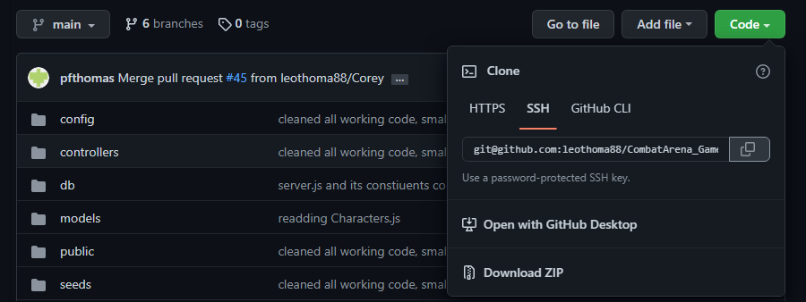
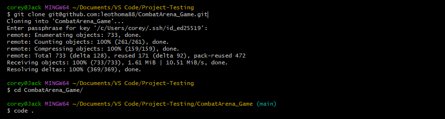
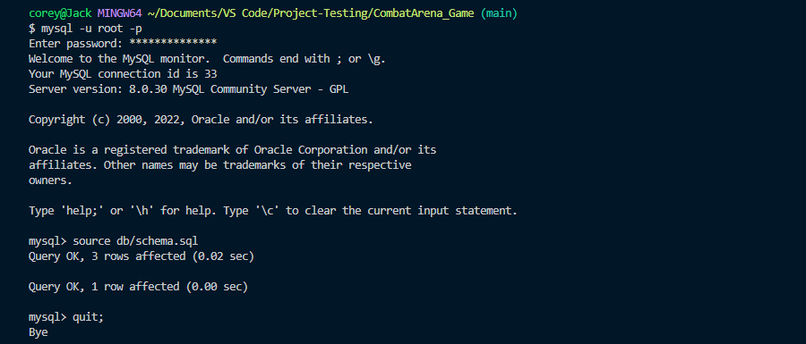
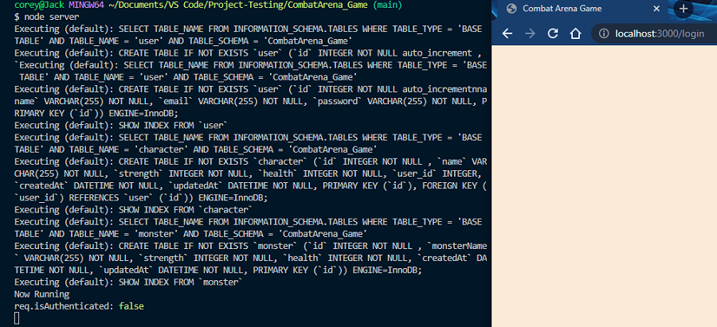
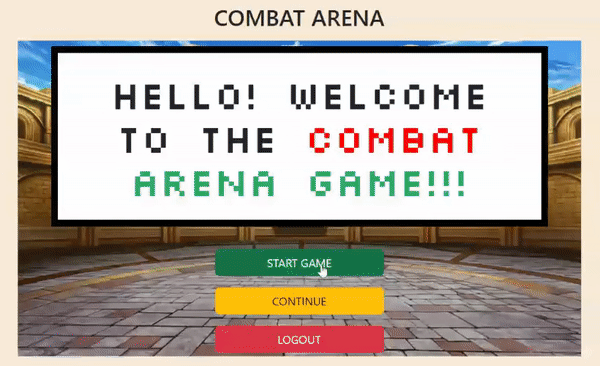

# COMBAT ARENA GAME

## Description

This is a full-stack project making use of Node.js and Express.js, MySQL and Sequelize, Handlebars.js for templating, GET & POST routes for adding and retrieving data, and Passport as a means of storing user login information. This respository adheres to the MVC paradigm for its file/folder structure. The app is deployed to Heroku or it can be cloned and run locally.

## Table of Contents

* [Installation](#installation)
* [Usage](#usage)
* [License](#license)
* [Contribute](#contribute)
* [Questions](#questions)

## Installation

### Clone the repository to your local machine

### Open a terminal, navigate to the cloned directory, and open it with your source-code editor

### Make sure [Node.js](https://coding-boot-camp.github.io/full-stack/nodejs/how-to-install-nodejs) is downloaded and installed following these instructions
### Make sure [My SQL](https://coding-boot-camp.github.io/full-stack/mysql/mysql-installation-guide) is downloaded and installed following these instructions
### Type the command 'npm install' to install all project dependencies
### Type the command 'mysql -u root -p' followed by your MySQL password. Once in MySQL, type 'source db/schema.sql' to initialize this project's database.

### Create a .env file with the following environment keys
* HOST = "localhost"
* DB_NAME= "CombatArena_Game"
* DB_USER = "root"
* DB_PASSWORD = "--your MySQL password--"
* SESSION_SECRET= "secret"
### Run the program by typing 'node server' and opening localhost:3000 on your browser

## Usage

### Proceed to Register as a first time user and create an account

### Once you've logged in, click 'Start Game' to be exposed to the tutorial text. Clicking 'Next' will send you into your first battle!

### Keep choosing your attack until either you or your opponent deplete your health bar. If you lose, click 'Restart' to reinitiate the battle. If you win, click 'Next' to return to the home screen.

### Clicking 'Continue' will bring you right into the action where you left off!
### Once you are done and satisfied, click 'Logout' to end your session and return to the login screen!

## License

This project is covered under the [ISC License](https://opensource.org/licenses/ISC)

## Contribute

If you wish to contribute to this project, follow these steps:

- Fork the repository
- Clone or download to your local machine
- Make any changes/updates and push to your remote fork
- Start a pull request

## Questions

Created by:
* [Nick Magarian](https://github.com/NickMagarian)
* [Leo Thomas](https://github.com/leothoma88)
* [Foster Thomas](https://github.com/pfthomas)
* [Corey Bennett](https://github.com/CWheelsRun)
* [Teresa Kariuki](https://github.com/kariukit)
* [Vaidec Trivedi](https://github.com/tvaidic)
  
If you have any further questions please feel free to contact us at [combat.arena.gtbootcamp@gmail.com](combat.arena.gtbootcamp@gmail.com)